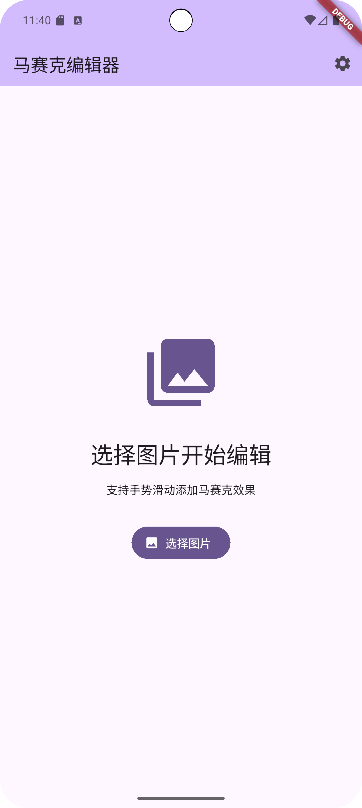
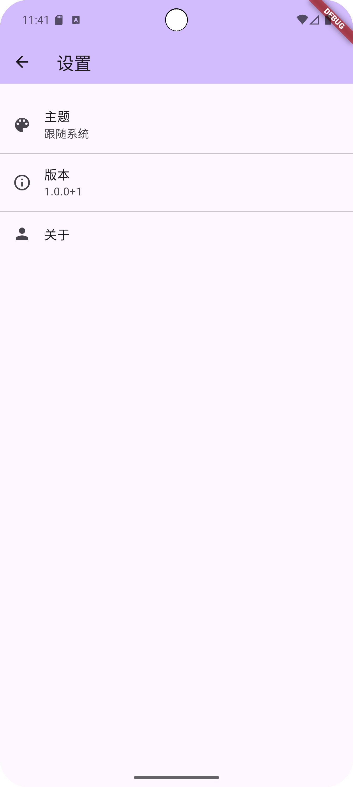

好的 ✅ 我帮你整理一个完整的 **README.md**，涵盖安装、使用、依赖说明等，保持简洁清晰。

---

# 📱 Mosaic Editor

一个基于 **Flutter (Material 3)** 的马赛克编辑器应用。
支持选择图片，使用手势添加马赛克效果，撤销/重做操作，并保存到相册。

---

## ✨ 功能特性

* 🖼️ **选择图片**：从相册导入图片
* 🎨 **马赛克画笔**：可调节画笔大小，自由滑动涂抹
* ↩️ **撤销 / 重做**：支持多步撤销与重做
* 💾 **保存图片**：保存到本地并同步到相册
* ⚙️ **设置页面**：主题、版本信息、关于
* 📖 **依赖展示**：自动生成依赖列表及开源许可证信息

---

## 🚀 安装与运行

1. **克隆项目**

   ```bash
   git clone https://github.com/your-repo/mosaic_editor.git
   cd mosaic_editor
   ```

2. **安装依赖**

   ```bash
   flutter pub get
   ```

3. **生成依赖信息**

   ```bash
   dart run tool/generate_dependencies.dart
   ```

4. **运行应用**

   ```bash
   flutter run
   ```

---

## 📦 主要依赖

| 包名                   | 用途         | 许可证          |
| -------------------- | ---------- | ------------ |
| `image_picker`       | 选择图片/视频    | MIT          |
| `gallery_saver_plus` | 保存图片/视频到相册 | MIT          |
| `path_provider`      | 获取本地路径     | BSD-3-Clause |
| `image`              | 图像处理库      | MIT          |
| `yaml`               | YAML 解析    | MIT          |

👉 完整依赖请在应用内 **设置 → 关于 → 开源协议** 查看。

---

## 📲 应用截图

| 首页                             | 编辑器                              | 设置                                 |
| ------------------------------ | -------------------------------- | ---------------------------------- |
|  |  |  |

---

## 🛠️ 开发说明

* 使用 **Material 3** 风格
* 跨平台支持 Android / iOS
* 依赖信息由 `tool/generate_dependencies.dart` 自动生成，存储于 `assets/dependencies.json`
* 图片处理使用 `package:image`

---

## 📜 开源协议

本项目基于 **MIT License** 开源。
详情请见 [LICENSE](LICENSE)。

---

要不要我帮你再加一个 **英文版 README**，方便放在 GitHub 上？
